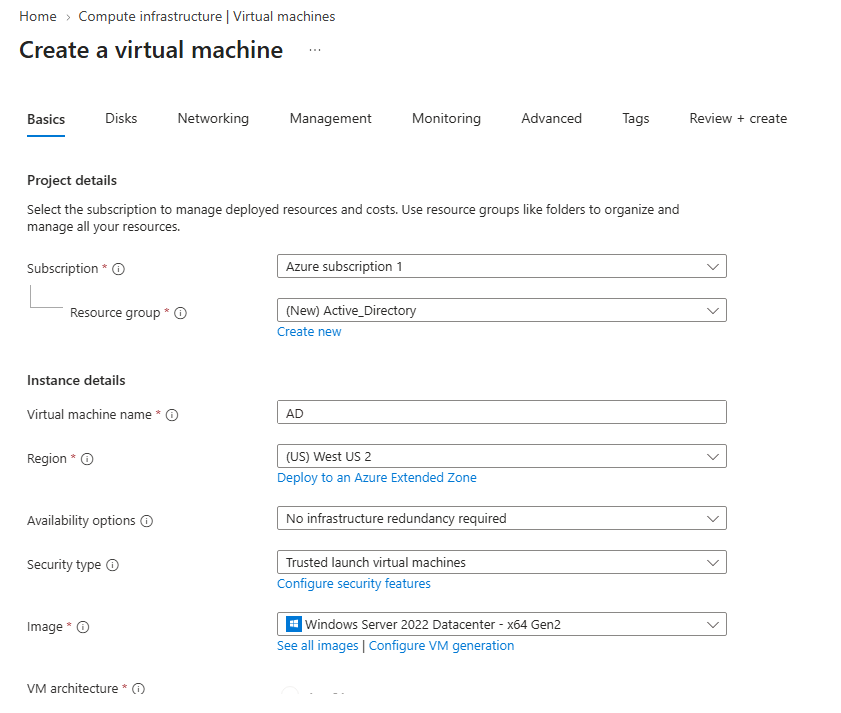
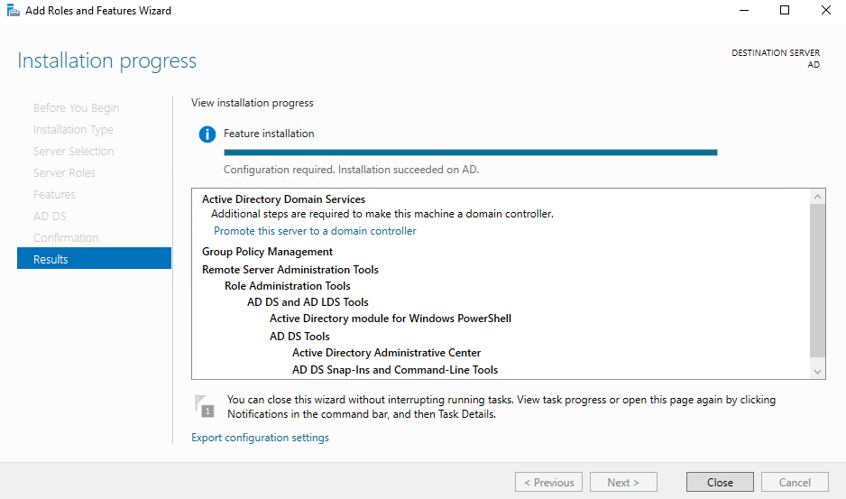
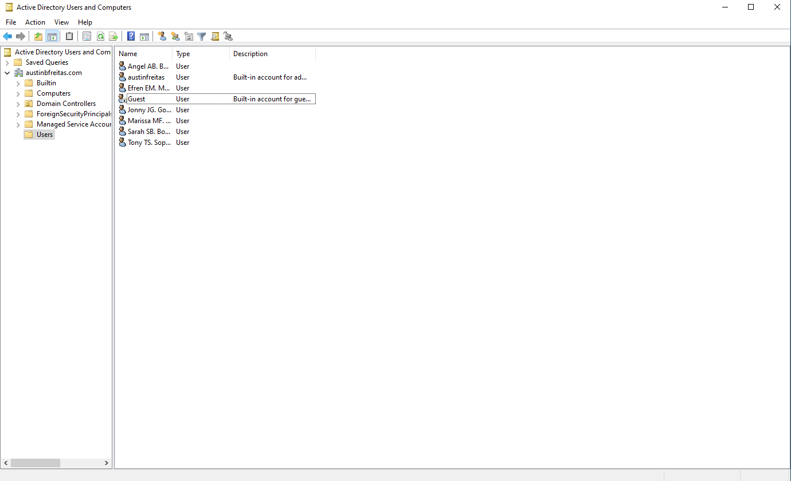
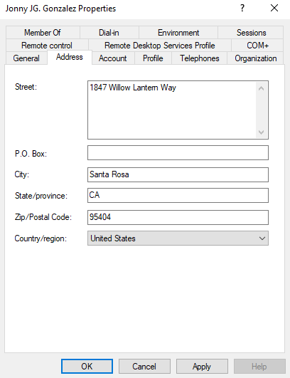
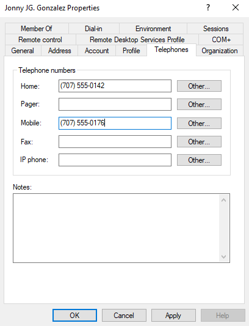
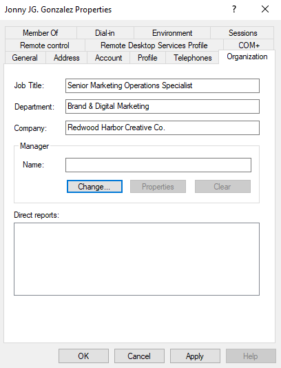
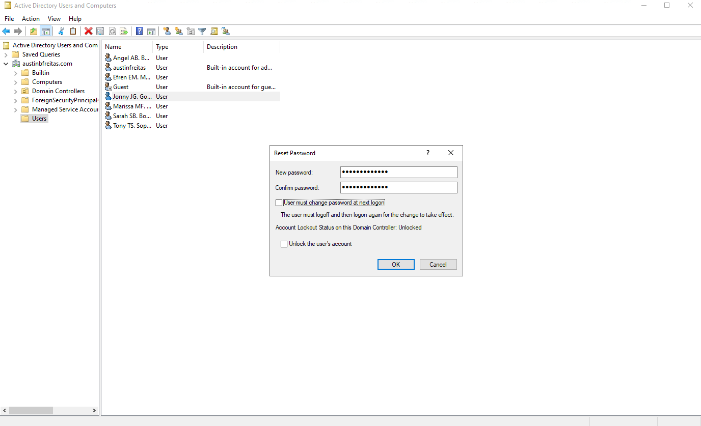
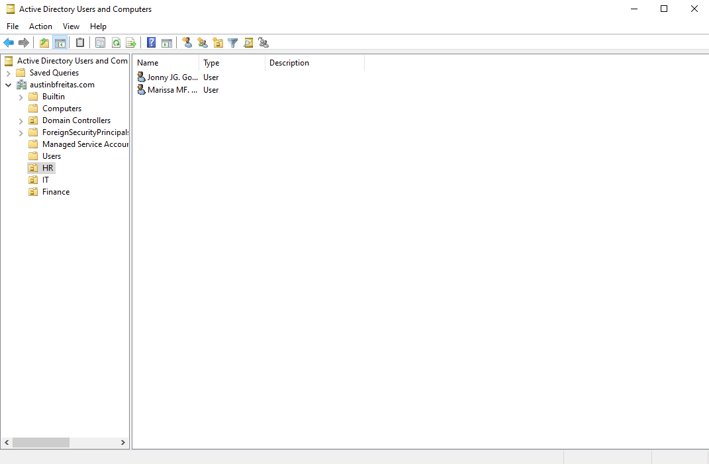
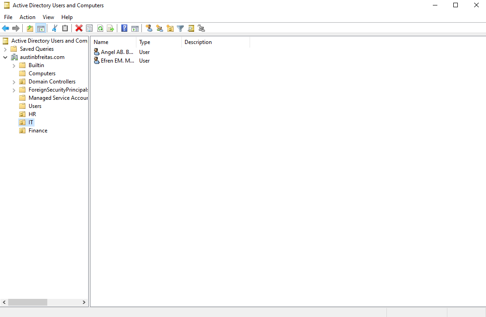
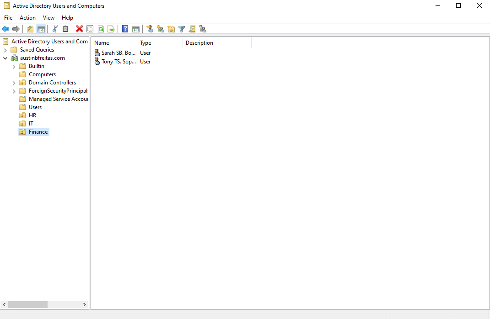

# Active Directory Home Lab Project

## Overview
I built this small Active Directory environment in Azure to practice the kind of work a help desk or junior sysadmin would actually do on the job. That included provisioning a server, setting up Active Directory Domain Services, creating and configuring user accounts, and organizing everything into department based Organizational Units.

---

## Step 1: Provision the Virtual Machine (Azure)
I started by deploying a Windows Server 2022 Datacenter (x64, Gen2) virtual machine through the Azure Portal. I created a new resource group called `Active_Directory`, named the VM `AD`, and deployed it to the West US 2 region. I kept it simple for a lab environment, so I used Trusted Launch for security and skipped infrastructure redundancy since this was just a single test server.

## Step 2: Install Active Directory Domain Services
Once the VM was up and running, I used Server Manager's Add Roles and Features Wizard to install the Active Directory Domain Services role along with the supporting management tools, including Group Policy Management, AD DS and AD LDS Tools, the Active Directory Administrative Center, and the AD Snap Ins. After the installation finished, I promoted the server to a Domain Controller and created a new forest with the domain name `austinbfreitas.com`.

## Step 3: Create User Accounts in Active Directory Users and Computers
With the domain up, I opened Active Directory Users and Computers and created a handful of test user accounts inside the default Users container to represent employees at a fictional company. I gave each account a unique display name so the directory would be easy to browse throughout the rest of the project.

## Step 4: Populate User Address Information
For each user I filled out the Address tab in their account properties with realistic contact details like street, city, state, zip, and country. This is the kind of profile data a help desk technician would normally maintain for employee records.

## Step 5: Populate User Telephone Information
Next I completed the Telephones tab for each user, adding home and mobile numbers so every account had complete contact info, similar to what you would pull up while working a support ticket.

## Step 6: Populate Organization Information
After that I filled in the Organization tab for each user with their job title, department, and company. For example, one user was set up as a Senior Marketing Operations Specialist in the Brand & Digital Marketing department at Redwood Harbor Creative Co. This step shows how AD attributes tie directly into a company's actual org structure.

## Step 7: Reset a User's Password
To practice one of the most common help desk tasks, I reset a user's password through Active Directory Users and Computers, setting a new password and checking the account lockout status while I was in there.

## Steps 8 through 10: Create Organizational Units and Sort Users by Department
Finally, I created three new Organizational Units, HR, IT, and Finance, under the domain, then moved each user out of the default Users container into the OU that matched their department. This organizes the directory the way a real company would structure it, which sets things up nicely for applying department specific Group Policies and permissions down the road.

---

## Skills Demonstrated
- Provisioning infrastructure in Microsoft Azure
- Installing and configuring Active Directory Domain Services
- Promoting a server to a Domain Controller and creating a new forest and domain
- Creating and managing user accounts in Active Directory Users and Computers
- Editing user profile attributes like address, phone, and organizational info
- Performing password resets and account management tasks
- Designing an OU structure and organizing users by department
